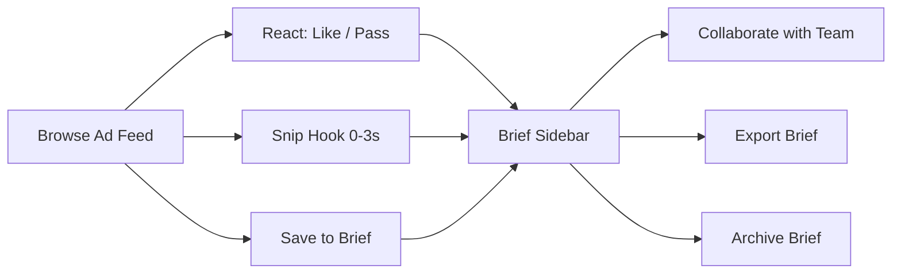
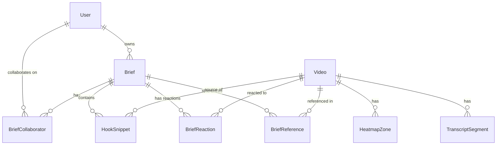
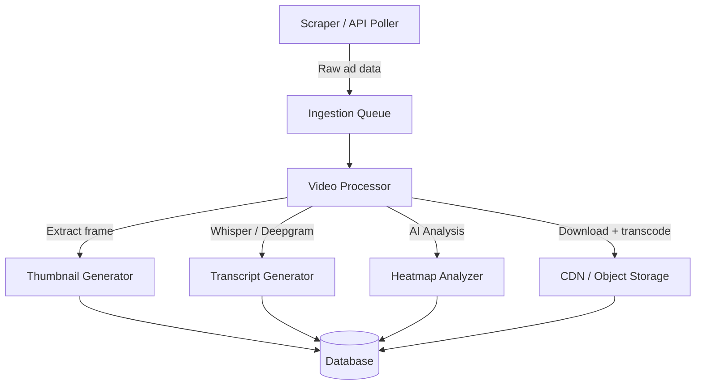
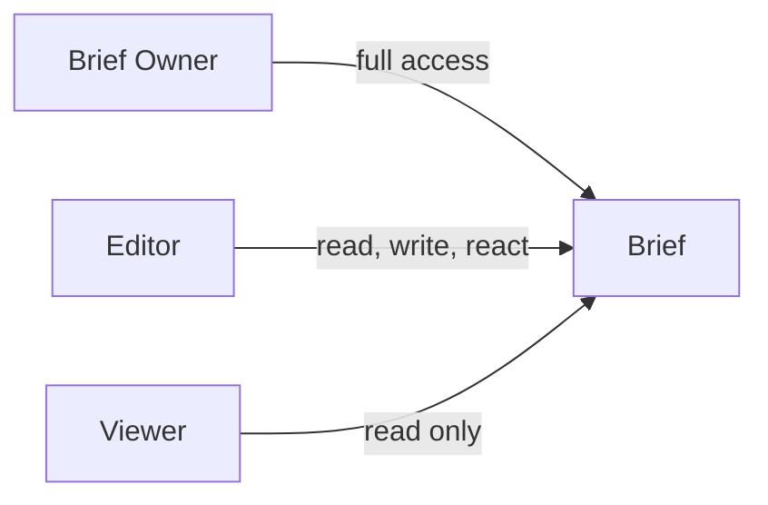
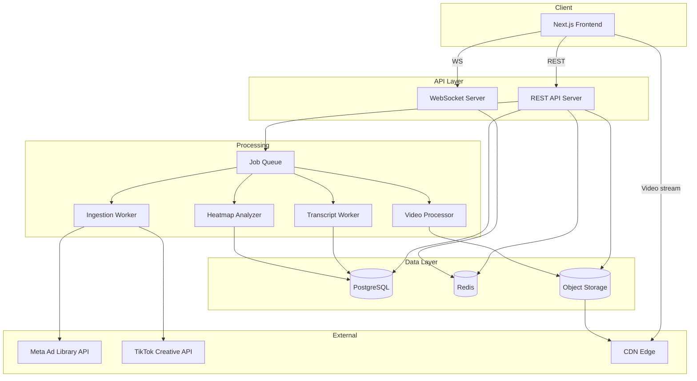

# LENS — Backend & Architecture Specification

**Version**: 1.0  
**Date**: 2026-02-13  
**Status**: Handoff to Backend & Architecture Team  
**Frontend Repo**: `celestial-zodiac` (Next.js 14, React 18, Tailwind CSS)

---

## 1. Product Overview

LENS is an **ad creative discovery and brief-building tool** for marketing teams. Users browse a curated feed of vertical video ads (9:16 format, similar to TikTok/Reels), organize them into creative briefs, snip hooks, react (like/pass), collaborate with teammates, and export finalized briefs.

### Core User Flows



### Key Screens

| Screen | Route | Description |
|--------|-------|-------------|
| Landing | `/` | Marketing page, CTA to workspace |
| Workspace | `/workspace` | Main app: video player + brief sidebar |

---

## 2. Data Models

> [!IMPORTANT]
> All IDs should be UUIDs. Timestamps should be ISO 8601 with timezone. The frontend currently uses client-generated IDs like `b-${Date.now()}` — the backend must generate proper UUIDs server-side.

### 2.1 Entity Relationship Diagram



### 2.2 `User`

| Field | Type | Notes |
|-------|------|-------|
| `id` | UUID | Primary key |
| `email` | string | Unique, used for login & invitations |
| `name` | string | Display name |
| `initials` | string(2) | Auto-derived from name, e.g. "JD" |
| `avatarUrl` | string? | Optional profile image URL |
| `avatarColor` | string | Hex color for initial-based avatars, e.g. `#5090f0` |
| `createdAt` | timestamp | |
| `updatedAt` | timestamp | |

### 2.3 `Video` (Ad Creative)

This is the core content entity — each record represents one ad creative sourced from Meta Ad Library, TikTok Creative Center, or YouTube.

| Field | Type | Notes |
|-------|------|-------|
| `id` | UUID | Primary key |
| `title` | string | Ad title / headline |
| `brand` | string | Advertiser / brand name |
| `platform` | enum | `meta`, `tiktok`, `youtube` |
| `category` | string | E.g. "Skincare", "Fitness", "Food & Beverage" |
| `thumbnailUrl` | string | CDN URL for thumbnail image |
| `videoUrl` | string | CDN URL for video file (MP4) |
| `duration` | integer | Video duration in seconds |
| `spend` | string? | Estimated ad spend, e.g. "$45K" |
| `impressions` | string? | E.g. "2.3M" |
| `ctr` | string? | Click-through rate, e.g. "2.8%" |
| `engagementRate` | string? | E.g. "6.4%" |
| `hookRate` | string? | % of viewers retained past hook (first 3s) |
| `performanceTier` | enum? | `top`, `high`, `mid`, `low` |
| `sourceUrl` | string? | Original URL in ad library (for attribution) |
| `createdAt` | timestamp | When ingested into system |
| `updatedAt` | timestamp | |

> [!NOTE]
> **Spend/impressions/CTR as strings**: The frontend currently displays these as formatted strings ("$45K", "2.3M"). The backend should store raw numeric values and provide both raw and formatted representations. Consider: `spendCents: integer`, `impressionsCount: integer`, `ctrPercent: decimal`.

### 2.4 `HeatmapZone`

AI-generated attention zones within a video, used to visualize hook/proof/CTA segments on the progress bar.

| Field | Type | Notes |
|-------|------|-------|
| `id` | UUID | Primary key |
| `videoId` | UUID | FK → Video |
| `start` | integer | Zone start (percentage 0-100 of video duration) |
| `end` | integer | Zone end (percentage 0-100) |
| `type` | enum | `hook`, `proof`, `cta` |
| `label` | string | Human-readable label, e.g. "Attention Hook" |

### 2.5 `TranscriptSegment`

AI-generated transcript of the video, used for the "Ghost Script" overlay feature.

| Field | Type | Notes |
|-------|------|-------|
| `id` | UUID | Primary key |
| `videoId` | UUID | FK → Video |
| `time` | decimal | Timestamp in seconds |
| `text` | string | Transcript text at this timestamp |

### 2.6 `Brief`

A creative brief that a user builds by collecting ads, hooks, and notes.

| Field | Type | Notes |
|-------|------|-------|
| `id` | UUID | Primary key |
| `ownerId` | UUID | FK → User (creator) |
| `title` | string | E.g. "Skincare UGC – Q1 Campaign" |
| `campaign` | string | Campaign name, e.g. "LumiSkin Spring Launch" |
| `angle` | string | Creative angle description |
| `content` | text | Markdown-formatted brief body |
| `archived` | boolean | Default `false` |
| `createdAt` | timestamp | |
| `updatedAt` | timestamp | Auto-updated on any mutation |

### 2.7 `HookSnippet`

A "snipped" hook — the first 3 seconds of a video, saved to a brief's Hook Bank.

| Field | Type | Notes |
|-------|------|-------|
| `id` | UUID | Primary key |
| `briefId` | UUID | FK → Brief |
| `videoId` | UUID | FK → Video |
| `videoTitle` | string | Denormalized for display |
| `thumbnailUrl` | string | Thumbnail of the snipped moment |
| `timestamp` | string | Time range, e.g. "0:00 – 0:03" |
| `notes` | text | User annotation |
| `createdAt` | timestamp | |

### 2.8 `BriefReaction` (Join Table)

Tracks like/dislike per video per brief per user.

| Field | Type | Notes |
|-------|------|-------|
| `id` | UUID | Primary key |
| `briefId` | UUID | FK → Brief |
| `videoId` | UUID | FK → Video |
| `userId` | UUID | FK → User |
| `reaction` | enum | `like`, `dislike` |
| `createdAt` | timestamp | |

**Unique constraint**: (`briefId`, `videoId`, `userId`) — one reaction per user per video per brief.

> [!IMPORTANT]
> The frontend currently stores `likedVideoIds` and `dislikedVideoIds` as arrays on the Brief. The backend should normalize this into a proper join table with user attribution. This enables **per-user reactions** in collaborative briefs.

### 2.9 `BriefReference` (Join Table)

Videos saved/referenced in a brief.

| Field | Type | Notes |
|-------|------|-------|
| `briefId` | UUID | FK → Brief |
| `videoId` | UUID | FK → Video |
| `addedBy` | UUID | FK → User |
| `createdAt` | timestamp | |

**Unique constraint**: (`briefId`, `videoId`)

### 2.10 `BriefCollaborator` (Join Table)

| Field | Type | Notes |
|-------|------|-------|
| `briefId` | UUID | FK → Brief |
| `userId` | UUID | FK → User |
| `role` | enum | `owner`, `editor`, `viewer` |
| `invitedAt` | timestamp | |
| `acceptedAt` | timestamp? | `null` until invitation accepted |

**Unique constraint**: (`briefId`, `userId`)

---

## 3. API Specification

> [!NOTE]
> All endpoints require authentication via Bearer token (see Section 5). All responses use JSON. Pagination uses cursor-based pagination with `cursor` and `limit` query params.

### 3.1 Authentication

| Method | Endpoint | Description |
|--------|----------|-------------|
| `POST` | `/api/auth/register` | Create account |
| `POST` | `/api/auth/login` | Email/password login → JWT |
| `POST` | `/api/auth/refresh` | Refresh access token |
| `POST` | `/api/auth/logout` | Invalidate refresh token |
| `GET` | `/api/auth/me` | Get current user profile |

---

### 3.2 Videos (Ad Library)

| Method | Endpoint | Description |
|--------|----------|-------------|
| `GET` | `/api/videos` | List/search videos (paginated) |
| `GET` | `/api/videos/:id` | Get video details + heatmap + transcript |

#### `GET /api/videos`

**Query Parameters:**

| Param | Type | Description |
|-------|------|-------------|
| `q` | string | Full-text search across title, brand, category |
| `platform` | enum | Filter: `meta`, `tiktok`, `youtube` |
| `category` | string | Filter by category |
| `performanceTier` | enum | Filter: `top`, `high`, `mid`, `low` |
| `minSpend` | integer | Filter: minimum spend in cents |
| `maxSpend` | integer | Filter: maximum spend in cents |
| `sortBy` | enum | `relevance`, `spend`, `impressions`, `hookRate`, `createdAt` |
| `cursor` | string | Pagination cursor |
| `limit` | integer | Page size (default 20, max 50) |

**Response:**

```json
{
  "data": [
    {
      "id": "uuid",
      "title": "Glowing Skin Serum – Social Proof UGC",
      "brand": "LumiSkin",
      "platform": "meta",
      "category": "Skincare",
      "thumbnailUrl": "https://cdn.lens.app/thumbs/v1.jpg",
      "videoUrl": "https://cdn.lens.app/videos/v1.mp4",
      "duration": 15,
      "spend": { "raw": 4500000, "formatted": "$45K" },
      "impressions": { "raw": 2300000, "formatted": "2.3M" },
      "ctr": { "raw": 2.8, "formatted": "2.8%" },
      "engagementRate": { "raw": 6.4, "formatted": "6.4%" },
      "hookRate": { "raw": 78, "formatted": "78%" },
      "performanceTier": "top",
      "heatmapZones": [
        { "start": 0, "end": 20, "type": "hook", "label": "Attention Hook" },
        { "start": 35, "end": 60, "type": "proof", "label": "Social Proof" },
        { "start": 80, "end": 100, "type": "cta", "label": "Call to Action" }
      ],
      "transcript": [
        { "time": 0, "text": "POV: You finally found the serum..." },
        { "time": 2, "text": "I've been using this for 3 weeks..." }
      ]
    }
  ],
  "pagination": {
    "nextCursor": "abc123",
    "hasMore": true,
    "total": 1240
  }
}
```

> [!TIP]
> **Search implementation**: For the initial version, PostgreSQL full-text search (`tsvector/tsquery`) across `title`, `brand`, and `category` is sufficient. For scale, migrate to Elasticsearch/Typesense as the ad library grows.

---

### 3.3 Briefs

| Method | Endpoint | Description |
|--------|----------|-------------|
| `GET` | `/api/briefs` | List user's briefs |
| `POST` | `/api/briefs` | Create a new brief |
| `GET` | `/api/briefs/:id` | Get brief with all relations |
| `PATCH` | `/api/briefs/:id` | Update brief metadata/content |
| `DELETE` | `/api/briefs/:id` | Permanently delete brief |
| `POST` | `/api/briefs/:id/archive` | Archive brief |
| `POST` | `/api/briefs/:id/unarchive` | Restore archived brief |
| `POST` | `/api/briefs/:id/export` | Export brief as PDF/document |

#### `GET /api/briefs`

**Query Parameters:**

| Param | Type | Description |
|-------|------|-------------|
| `archived` | boolean | Filter by archived status (default `false`) |
| `sortBy` | enum | `updatedAt`, `createdAt`, `title` |

**Response:**

```json
{
  "data": [
    {
      "id": "uuid",
      "title": "Skincare UGC – Q1 Campaign",
      "campaign": "LumiSkin Spring Launch",
      "angle": "",
      "archived": false,
      "collaborators": [
        { "userId": "uuid", "name": "You", "initials": "Y", "avatarColor": "#5090f0", "role": "owner" }
      ],
      "stats": {
        "referenceCount": 3,
        "hookCount": 2,
        "likedCount": 5,
        "dislikedCount": 1
      },
      "createdAt": "2026-01-15T10:00:00Z",
      "updatedAt": "2026-02-12T14:30:00Z"
    }
  ]
}
```

#### `POST /api/briefs`

**Request:**

```json
{
  "title": "Summer Campaign – DTC Fitness",
  "campaign": "Q2 Growth",
  "angle": "UGC testimonial-style"
}
```

**Response:** Returns full brief object with `id`, defaults populated.

#### `PATCH /api/briefs/:id`

**Request (all fields optional):**

```json
{
  "title": "Updated Title",
  "campaign": "New Campaign",
  "angle": "New Angle",
  "content": "# Updated markdown content..."
}
```

---

### 3.4 Brief References (Saved Videos)

| Method | Endpoint | Description |
|--------|----------|-------------|
| `POST` | `/api/briefs/:id/references` | Save a video to brief |
| `DELETE` | `/api/briefs/:id/references/:videoId` | Remove video from brief |
| `GET` | `/api/briefs/:id/references` | List referenced videos |

#### `POST /api/briefs/:id/references`

```json
{ "videoId": "uuid" }
```

---

### 3.5 Hook Snippets

| Method | Endpoint | Description |
|--------|----------|-------------|
| `POST` | `/api/briefs/:id/hooks` | Snip a hook from a video |
| `DELETE` | `/api/briefs/:id/hooks/:hookId` | Remove a hook |
| `PATCH` | `/api/briefs/:id/hooks/:hookId` | Update hook notes |
| `GET` | `/api/briefs/:id/hooks` | List hooks in brief |

#### `POST /api/briefs/:id/hooks`

**Request:**

```json
{
  "videoId": "uuid",
  "startTime": 0,
  "endTime": 3,
  "notes": ""
}
```

**Response:**

```json
{
  "id": "uuid",
  "videoId": "uuid",
  "videoTitle": "Glowing Skin Serum – Social Proof UGC",
  "thumbnailUrl": "https://cdn.lens.app/thumbs/v1-hook.jpg",
  "timestamp": "0:00 – 0:03",
  "notes": "",
  "createdAt": "2026-02-13T08:00:00Z"
}
```

> [!NOTE]
> **Hook thumbnail generation**: When a hook is snipped, the backend should extract a frame from the video at `startTime` and generate a thumbnail. This can be done async via a job queue (see Section 6).

---

### 3.6 Reactions (Like / Dislike)

| Method | Endpoint | Description |
|--------|----------|-------------|
| `POST` | `/api/briefs/:id/reactions` | Like or dislike a video |
| `DELETE` | `/api/briefs/:id/reactions/:videoId` | Remove reaction |
| `GET` | `/api/briefs/:id/reactions` | List all reactions (with user attribution) |

#### `POST /api/briefs/:id/reactions`

**Request:**

```json
{
  "videoId": "uuid",
  "reaction": "like"
}
```

**Behavior:**
- If the user already has a reaction on this video in this brief, it is **replaced** (e.g. like → dislike)
- Liking auto-removes a dislike and vice versa (matching frontend behavior)

#### `GET /api/briefs/:id/reactions`

**Response:**

```json
{
  "likes": [
    { "videoId": "uuid", "videoTitle": "...", "userId": "uuid", "userName": "Alice", "createdAt": "..." }
  ],
  "dislikes": [
    { "videoId": "uuid", "videoTitle": "...", "userId": "uuid", "userName": "Bob", "createdAt": "..." }
  ],
  "summary": { "likedCount": 5, "dislikedCount": 1 }
}
```

---

### 3.7 Collaborators

| Method | Endpoint | Description |
|--------|----------|-------------|
| `POST` | `/api/briefs/:id/collaborators` | Invite a collaborator |
| `DELETE` | `/api/briefs/:id/collaborators/:userId` | Remove collaborator |
| `PATCH` | `/api/briefs/:id/collaborators/:userId` | Update role |
| `GET` | `/api/briefs/:id/collaborators` | List collaborators |

#### `POST /api/briefs/:id/collaborators`

**Request:**

```json
{
  "email": "teammate@company.com",
  "role": "editor"
}
```

**Behavior:**
- If user exists → add to brief immediately
- If user doesn't exist → create invitation record, send email invite
- Only `owner` can invite/remove collaborators

---

## 4. Video Ingestion Pipeline

> [!IMPORTANT]
> This is a critical backend-only system. The frontend has no awareness of this pipeline — it simply queries `/api/videos`.

### 4.1 Sources

| Source | API | Notes |
|--------|-----|-------|
| Meta Ad Library | [Meta Ad Library API](https://www.facebook.com/ads/library/api/) | Requires app review |
| TikTok Creative Center | [TikTok Commercial Content API](https://ads.tiktok.com/marketing_api/) | Requires business account |
| YouTube Ads | YouTube Data API v3 | Limited ad-specific data |

### 4.2 Pipeline Architecture



### 4.3 Processing Steps

1. **Fetch**: Poll ad library APIs on schedule (hourly/daily)
2. **Deduplicate**: Check if ad already exists by source URL or content hash
3. **Download**: Store video file in object storage (S3/GCS)
4. **Transcode**: Generate web-optimized MP4 (H.264, 720p max for bandwidth)
5. **Thumbnail**: Extract frame at 1s as JPEG thumbnail
6. **Transcript**: Run Whisper/Deepgram for speech-to-text with timestamps
7. **Heatmap**: AI model analyzes video structure to identify hook/proof/CTA zones
8. **Performance Data**: Fetch spend, impressions, CTR from ad platform APIs
9. **Categorize**: Auto-tag category and performance tier
10. **Publish**: Mark as available in search index

---

## 5. Authentication & Authorization

### 5.1 Auth Flow

| Component | Choice | Notes |
|-----------|--------|-------|
| Strategy | JWT (access + refresh tokens) | Short-lived access (15min), long-lived refresh (7d) |
| Provider | Consider Auth0, Clerk, or Supabase Auth | Reduces implementation burden |
| Social Login | Google OAuth (priority), optional SSO | Most marketing teams use Google Workspace |

### 5.2 Authorization Model



| Action | Owner | Editor | Viewer |
|--------|-------|--------|--------|
| View brief | ✅ | ✅ | ✅ |
| Edit brief content | ✅ | ✅ | ❌ |
| Add/remove references | ✅ | ✅ | ❌ |
| Snip hooks | ✅ | ✅ | ❌ |
| React (like/dislike) | ✅ | ✅ | ✅ |
| Invite collaborators | ✅ | ❌ | ❌ |
| Remove collaborators | ✅ | ❌ | ❌ |
| Archive/delete brief | ✅ | ❌ | ❌ |
| Export brief | ✅ | ✅ | ✅ |

---

## 6. Architecture Recommendations

### 6.1 Recommended Stack

| Layer | Technology | Rationale |
|-------|-----------|-----------|
| **API** | Node.js (Fastify/Express) or Python (FastAPI) | Team familiarity, quick iteration |
| **Database** | PostgreSQL 15+ | Relational data, full-text search, JSONB for flexibility |
| **Cache** | Redis | Session store, search result caching, rate limiting |
| **Object Storage** | AWS S3 / GCS | Video and thumbnail hosting |
| **CDN** | CloudFront / Cloudflare R2 | Global video delivery with low latency |
| **Job Queue** | BullMQ (Node) / Celery (Python) | Async processing (transcripts, thumbnails, ingestion) |
| **Search** | PostgreSQL FTS → Elasticsearch (at scale) | Start simple, migrate when needed |
| **Real-time** | WebSockets (Socket.io / native WS) | Collaboration sync (Phase 2) |

### 6.2 System Diagram



### 6.3 Database Schema (PostgreSQL)

```sql
-- Users
CREATE TABLE users (
    id          UUID PRIMARY KEY DEFAULT gen_random_uuid(),
    email       TEXT UNIQUE NOT NULL,
    name        TEXT NOT NULL,
    initials    TEXT NOT NULL,
    avatar_url  TEXT,
    avatar_color TEXT NOT NULL DEFAULT '#5090f0',
    password_hash TEXT, -- null if using OAuth only
    created_at  TIMESTAMPTZ DEFAULT now(),
    updated_at  TIMESTAMPTZ DEFAULT now()
);

-- Videos (Ad Creatives)
CREATE TABLE videos (
    id               UUID PRIMARY KEY DEFAULT gen_random_uuid(),
    title            TEXT NOT NULL,
    brand            TEXT NOT NULL,
    platform         TEXT NOT NULL CHECK (platform IN ('meta', 'tiktok', 'youtube')),
    category         TEXT NOT NULL,
    thumbnail_url    TEXT NOT NULL,
    video_url        TEXT NOT NULL,
    duration         INTEGER NOT NULL,
    spend_cents      BIGINT,
    impressions      BIGINT,
    ctr_percent      DECIMAL(5,2),
    engagement_rate  DECIMAL(5,2),
    hook_rate        DECIMAL(5,2),
    performance_tier TEXT CHECK (performance_tier IN ('top', 'high', 'mid', 'low')),
    source_url       TEXT,
    search_vector    TSVECTOR, -- for full-text search
    created_at       TIMESTAMPTZ DEFAULT now(),
    updated_at       TIMESTAMPTZ DEFAULT now()
);

CREATE INDEX idx_videos_search ON videos USING GIN (search_vector);
CREATE INDEX idx_videos_platform ON videos (platform);
CREATE INDEX idx_videos_category ON videos (category);
CREATE INDEX idx_videos_tier ON videos (performance_tier);

-- Heatmap Zones
CREATE TABLE heatmap_zones (
    id        UUID PRIMARY KEY DEFAULT gen_random_uuid(),
    video_id  UUID NOT NULL REFERENCES videos(id) ON DELETE CASCADE,
    start_pct INTEGER NOT NULL,
    end_pct   INTEGER NOT NULL,
    type      TEXT NOT NULL CHECK (type IN ('hook', 'proof', 'cta')),
    label     TEXT NOT NULL
);

-- Transcript Segments
CREATE TABLE transcript_segments (
    id        UUID PRIMARY KEY DEFAULT gen_random_uuid(),
    video_id  UUID NOT NULL REFERENCES videos(id) ON DELETE CASCADE,
    time_sec  DECIMAL(8,2) NOT NULL,
    text      TEXT NOT NULL
);

CREATE INDEX idx_transcript_video ON transcript_segments (video_id, time_sec);

-- Briefs
CREATE TABLE briefs (
    id         UUID PRIMARY KEY DEFAULT gen_random_uuid(),
    owner_id   UUID NOT NULL REFERENCES users(id),
    title      TEXT NOT NULL,
    campaign   TEXT NOT NULL DEFAULT '',
    angle      TEXT NOT NULL DEFAULT '',
    content    TEXT NOT NULL DEFAULT '',
    archived   BOOLEAN NOT NULL DEFAULT false,
    created_at TIMESTAMPTZ DEFAULT now(),
    updated_at TIMESTAMPTZ DEFAULT now()
);

CREATE INDEX idx_briefs_owner ON briefs (owner_id, archived);

-- Brief Collaborators
CREATE TABLE brief_collaborators (
    brief_id    UUID NOT NULL REFERENCES briefs(id) ON DELETE CASCADE,
    user_id     UUID NOT NULL REFERENCES users(id),
    role        TEXT NOT NULL DEFAULT 'editor' CHECK (role IN ('owner', 'editor', 'viewer')),
    invited_at  TIMESTAMPTZ DEFAULT now(),
    accepted_at TIMESTAMPTZ,
    PRIMARY KEY (brief_id, user_id)
);

-- Brief References (Saved Videos)
CREATE TABLE brief_references (
    brief_id   UUID NOT NULL REFERENCES briefs(id) ON DELETE CASCADE,
    video_id   UUID NOT NULL REFERENCES videos(id),
    added_by   UUID NOT NULL REFERENCES users(id),
    created_at TIMESTAMPTZ DEFAULT now(),
    PRIMARY KEY (brief_id, video_id)
);

-- Hook Snippets
CREATE TABLE hook_snippets (
    id            UUID PRIMARY KEY DEFAULT gen_random_uuid(),
    brief_id      UUID NOT NULL REFERENCES briefs(id) ON DELETE CASCADE,
    video_id      UUID NOT NULL REFERENCES videos(id),
    video_title   TEXT NOT NULL,
    thumbnail_url TEXT,
    start_time    DECIMAL(8,2) NOT NULL DEFAULT 0,
    end_time      DECIMAL(8,2) NOT NULL DEFAULT 3,
    notes         TEXT NOT NULL DEFAULT '',
    created_at    TIMESTAMPTZ DEFAULT now()
);

CREATE INDEX idx_hooks_brief ON hook_snippets (brief_id);

-- Brief Reactions
CREATE TABLE brief_reactions (
    id        UUID PRIMARY KEY DEFAULT gen_random_uuid(),
    brief_id  UUID NOT NULL REFERENCES briefs(id) ON DELETE CASCADE,
    video_id  UUID NOT NULL REFERENCES videos(id),
    user_id   UUID NOT NULL REFERENCES users(id),
    reaction  TEXT NOT NULL CHECK (reaction IN ('like', 'dislike')),
    created_at TIMESTAMPTZ DEFAULT now(),
    UNIQUE (brief_id, video_id, user_id)
);

CREATE INDEX idx_reactions_brief ON brief_reactions (brief_id);
```

---

## 7. Frontend → Backend Migration Map

This section maps the current frontend state actions to backend API calls, to guide the integration work.

| Frontend Action | Current Implementation | Backend Endpoint |
|----------------|----------------------|-----------------|
| `SET_ACTIVE_VIDEO` | Client-side state | No API call needed (client routing) |
| `SET_ACTIVE_BRIEF` | Client-side state | No API call needed |
| `SET_SEARCH_QUERY` + `SET_SEARCH_RESULTS` | In-memory filter with 800ms delay | `GET /api/videos?q=...` |
| `CREATE_BRIEF` | localStorage | `POST /api/briefs` |
| `UPDATE_BRIEF_META` | localStorage | `PATCH /api/briefs/:id` |
| `UPDATE_BRIEF_CONTENT` | localStorage | `PATCH /api/briefs/:id` |
| `ARCHIVE_BRIEF` | localStorage | `POST /api/briefs/:id/archive` |
| `UNARCHIVE_BRIEF` | localStorage | `POST /api/briefs/:id/unarchive` |
| `ADD_REFERENCE_VIDEO` | localStorage | `POST /api/briefs/:id/references` |
| `REMOVE_REFERENCE_VIDEO` | localStorage | `DELETE /api/briefs/:id/references/:videoId` |
| `ADD_HOOK` | localStorage | `POST /api/briefs/:id/hooks` |
| `REMOVE_HOOK` | localStorage | `DELETE /api/briefs/:id/hooks/:hookId` |
| `LIKE_VIDEO` | localStorage | `POST /api/briefs/:id/reactions` body: `{reaction: "like"}` |
| `DISLIKE_VIDEO` | localStorage | `POST /api/briefs/:id/reactions` body: `{reaction: "dislike"}` |
| `UNLIKE_VIDEO` | localStorage | `DELETE /api/briefs/:id/reactions/:videoId` |
| `ADD_COLLABORATOR` | localStorage | `POST /api/briefs/:id/collaborators` |
| `REMOVE_COLLABORATOR` | localStorage | `DELETE /api/briefs/:id/collaborators/:userId` |

> [!IMPORTANT]
> **Migration Strategy**: The frontend store should be refactored to make API calls and then update local state on success. Use optimistic updates for reactions and references (update UI immediately, rollback on API failure). Use await for brief creation and collaborator management.

---

## 8. Non-Functional Requirements

### 8.1 Performance

| Metric | Target | Notes |
|--------|--------|-------|
| Video feed page load | < 500ms | First 5 video metadata + thumbnails |
| Search results | < 300ms | Full-text search response |
| Brief CRUD operations | < 200ms | API response time |
| Video start playback | < 2s | Time from request to first frame (CDN) |
| Concurrent users | 500+ | Initial target |

### 8.2 Video Delivery

- **Format**: H.264 MP4, web-optimized (moov atom at start)
- **Resolution**: Up to 720p for bandwidth efficiency
- **Aspect Ratio**: 9:16 (vertical) is the primary format
- **CDN**: Videos must be served from edge CDN, not backend
- **Range Requests**: Must support HTTP range requests for seeking

### 8.3 Security

- All API endpoints authenticated (except `/api/auth/register` and `/api/auth/login`)
- Rate limiting: 100 req/min per user for API, 10 req/min for auth
- Input validation on all endpoints
- SQL injection prevention (parameterized queries)
- XSS prevention (sanitize markdown content)
- CORS configuration for frontend origin only

### 8.4 Observability

- Structured JSON logging
- Request ID propagation
- API latency metrics (p50, p95, p99)
- Error rate monitoring
- Video processing job queue depth

---

## 9. Phase Plan

### Phase 1 — MVP Backend (4-6 weeks)

- [ ] User auth (JWT + Google OAuth)
- [ ] Video CRUD + search API (seed with sample data)
- [ ] Brief CRUD + archive/unarchive
- [ ] References, hooks, reactions APIs
- [ ] Collaborator invite/remove
- [ ] PostgreSQL database + migrations
- [ ] S3 integration for video storage
- [ ] CDN setup for video delivery
- [ ] Frontend migration from localStorage to API

### Phase 2 — Ingestion & Intelligence (4-6 weeks)

- [ ] Meta Ad Library integration
- [ ] TikTok Creative Center integration
- [ ] Video processing pipeline (transcode, thumbnails)
- [ ] AI transcript generation (Whisper/Deepgram)
- [ ] AI heatmap analysis
- [ ] Performance data fetching & tier calculation
- [ ] Search enhancement (Elasticsearch if needed)

### Phase 3 — Collaboration & Scale (3-4 weeks)

- [ ] WebSocket real-time sync for collaborative briefs
- [ ] Email invitation flow
- [ ] Brief export as PDF
- [ ] Activity log / audit trail
- [ ] Advanced filtering (date range, spend range, multiple categories)
- [ ] User preferences & settings

---

## 10. Open Questions for Architecture Review

1. **Multi-tenancy**: Are briefs scoped to a team/organization, or just individual users who invite collaborators? This affects data isolation.

2. **Video storage cost**: At scale, video storage could be expensive. Should we store videos ourselves or link to source platform URLs (which may expire)?

3. **Heatmap generation**: What model/approach for auto-detecting hook/proof/CTA zones? Custom ML model, or rule-based (e.g., first 3s = hook)?

4. **Real-time collaboration priority**: How important is real-time sync (e.g., two users editing a brief simultaneously)? This significantly affects architecture complexity.

5. **Brief export format**: PDF, Google Docs, or both? Does it need to include embedded video thumbnails?

6. **Rate limits & quotas**: Should free-tier users have limits on number of briefs, collaborators, or saved references?
